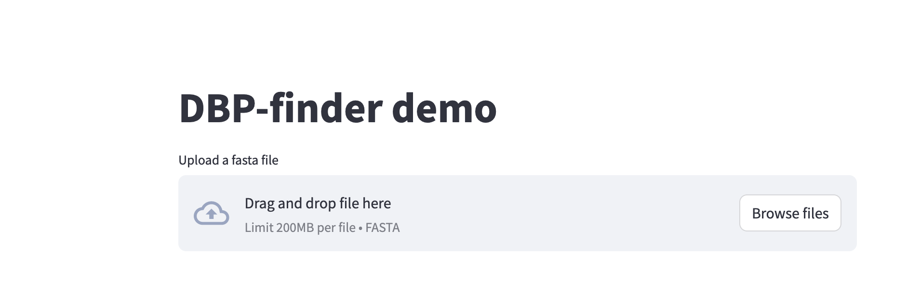
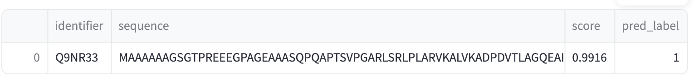

# DBP-finder
Advanced deep learning tool developed for the precise identification of DNA-binding proteins (DBPs). Using state-of-the-art pretrained language model (Ankh), DBP-finder accurately predicts DBPs from protein sequence data, aiding researchers in understanding genetic regulation and protein function.


## Install

### Environment
```bash
conda env create -f env.yaml
conda activate DBP-finder
```

### Demo
1. Click on the [link](http://217.79.62.70:8501).

2. On the app's homepage, you will find an input field to submit your protein sequence in __FASTA__ format.
3. The output is presented in a table format with the following columns:

   - **Identifier**: The unique identifier of the protein.
   - **Sequence**: The amino acid sequence of the protein.
   - **score**: The calculated score reflects the confidence level of the prediction, with higher scores suggesting a greater likelihood that the protein binds to DNA.
   - **pred_label**: A label of "1" indicates that the protein is predicted to be DNA-binding, while a label "0" suggests it is not DNA-binding.
